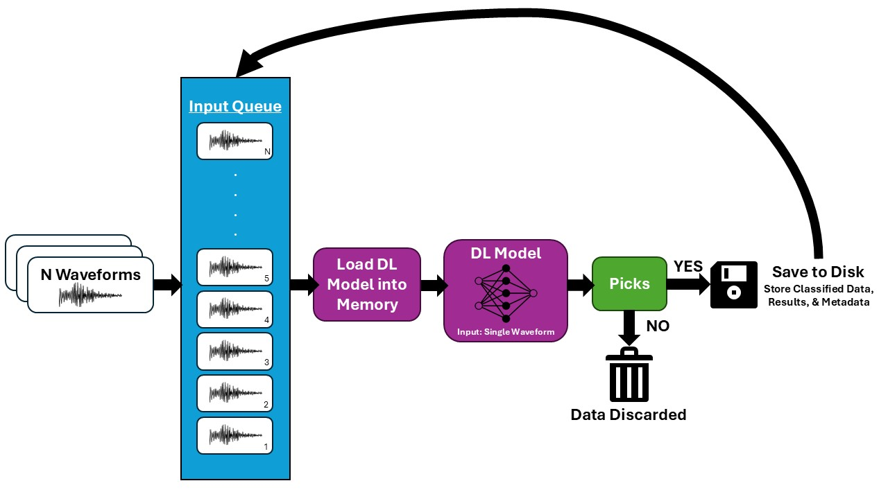
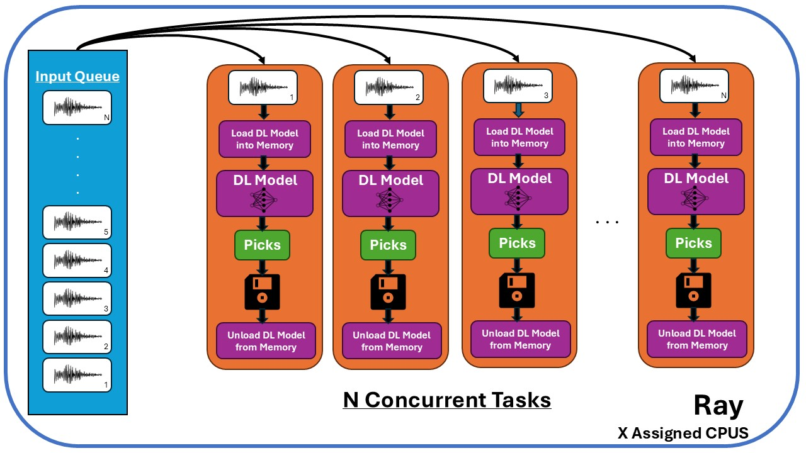
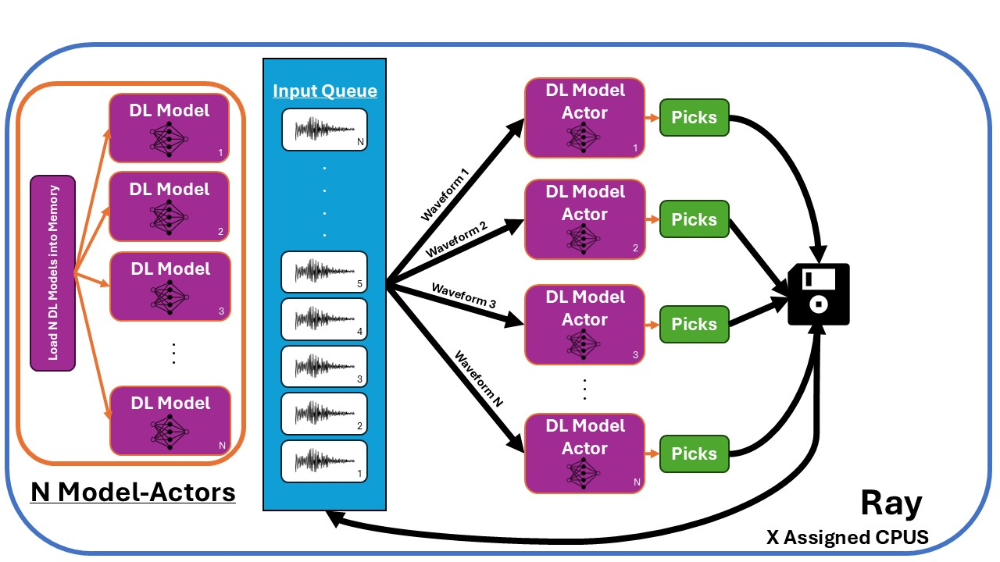
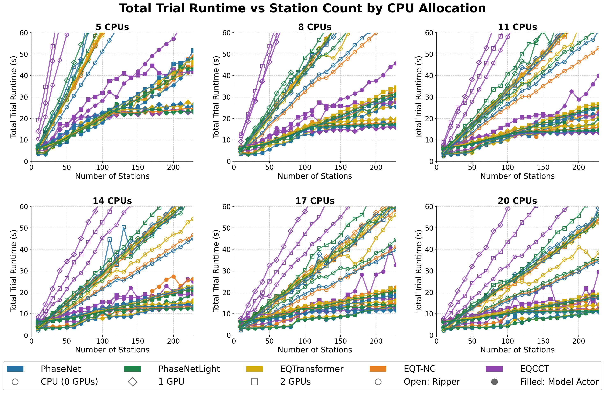

# RAPID: A Generalized High-Performance Parallelization Framework for Real-Time Deep Learning Seismic Phase Picking

## Abstract

Deep learning has transformed seismic phase picking, yet deploying these models at network scale in real time remains an unresolved engineering challenge. While unified libraries such as SeisBench excel at high-throughput offline batch inference, these methods are ill-suited for continuous monitoring, where waveforms arrive asynchronously from individual stations and cannot be held in memory until a full batch is assembled. The naive alternative, dispatching each station as an independent parallel task, forces repeated framework initialization for every waveform, inflating wall times and consuming much of the available real-time budget unless concurrency and hardware are tuned carefully. To resolve this, we introduce **RAPID (Resource-Aware Parallel Inference Dispatcher)**, a generalized orchestration framework that implements two task parallelization strategies: **Ripper**, an ephemeral task-based approach, and **Model-Actor**, which keeps persistent inference instances loaded in memory across an entire processing window. We benchmarked RAPID across five deep learning phase pickers (PhaseNet, PhaseNetLight, EQTransformer, EQTransformer-NonConservative, and EQCCT) using 228 three-component 60-second waveforms from the Texas Seismological Network under various hardware constraints that reflect real operational deployment scenarios. Across all configurations, the Model-Actor strategy delivered the fastest total runtimes (10.51–17.07 s), reducing processing time by roughly 40–88% relative to the best Ripper totals at 228 stations. These results show that the dominant bottleneck in network-scale DL picking is not raw inference complexity but orchestration overhead, and that persistent-actor lifecycle management delivers substantially faster totals and larger headroom under the 30-second target than even the best tuned ephemeral-task baseline.

## 1. Introduction

Accurate and timely identification of seismic phase arrivals is fundamental to earthquake monitoring. For decades, seismic networks have relied on energy-ratio algorithms, primarily the Short-Term Average/Long-Term Average, to automate event detection (Saad et al., 2023; Chen et al., 2024). While computationally inexpensive, these algorithms are sensitive to background noise, requiring station-specific tuning, and often leading to high rates of false-positives in complex environments.

Over the past decade, deep learning (DL) has emerged as a high-performance alternative. Models such as PhaseNet (Zhu & Beroza, 2018), EQTransformer (Mousavi et al., 2020), and EQCCT (Saad et al., 2023) consistently outperform traditional picking methods in both precision and recall, particularly in low signal-to-noise conditions. SeisBench (Woollam et al., 2022) has consolidated many of these models into a unified interface along with several datasets (Münchmeyer et al., 2022), establishing itself as the standard library for DL phase-picking research.

Many seismic networks are now working to integrate these pickers into their real-time operational workflows. However, while SeisBench provides a framework for training and deploying models, it does not provide a built-in methodology for parallel task orchestration capable of real-time processing. In this work, we define *real-time processing* as generating picks for an entire selection of stations within 30 seconds of a 60-second processing window.

SeisBench supports two primary waveform processing modes. The first, *offline batch mode*, processes waveforms in a single `annotate()` call. This method uses internal batching to achieve sub-second runtimes for entire networks (0.22–1.22 s for 228 stations). While highly effective for post-event analysis, it is incompatible with real-time monitoring. Operationally, waveforms arrive asynchronously from individual stations due to factors such as network latency and or power failures. As a result, incoming waveforms cannot be held in memory until a full batch is assembled because the processing window will continue to advance forward in time. 

The second mode, *per-station streaming*, uses the `classify()` method to process one waveform at a time. This method windows the incoming trace, runs a forward pass, and extracts phase arrivals. Since the model remains in memory between calls, no per-station reinitialization cost is paid. For the four SeisBench-integrated architectures tested here, sequential processing of 228 stations requires 1.43–33.70 s. While these times might seem sufficient, `classify()` has four structural limitations:

**(1) Hardware Non-Scalability:** Because it processes stations sequentially, adding more CPU cores or GPUs does not improve throughput. Runtime remains limited by the performance of a single model instance.

**(2) Operational Scale Failure:** Scaling to even larger network sizes, PhaseNet running on a single CPU reaches 35.85 s for 250 stations (TexNet) and 80.23 s for 580 stations (NCSN), already exceeding real-time deadlines.

**(3) Shared Inference Budget:** The 30-second window must also accommodate data quality checks, phase association, and alert dispatch. A 2-second margin is insufficient for operational stability.

**(4) Registry Limitations:** Models not yet integrated into SeisBench, such as EQCCT or custom institutional pickers, lack a `classify()` path, forcing networks to find other multi-waveform processing alternatives.

While parallelization is the intuitive remedy for these sequential processing constraints, treating each station as a separate parallel task (Ripper) forces the machine learning framework to re-initialize for every station. On our hardware that cost dominates runtimes at 228 stations: best observed Ripper totals span roughly **26.5–63 s** on CPU and **46.6–87.5 s** on GPU. The four SeisBench CPU cases finish just under the 30-second target when concurrency is tuned, but GPU Ripper and EQCCT on CPU remain above it, leaving little margin for association, quality control, and dispatch compared with persistent-actor runs.

To address these issues, we introduce **RAPID (Resource-Aware Parallel Inference Dispatcher)**, a generalized, resource-aware parallelization framework. RAPID is designed to complement SeisBench by using its native `from_pretrained()`, `annotate()`, and `classify()` interfaces while providing the necessary orchestration for real-time scale. We implement two strategies: **Model-Actor** (persistent instances) and **Ripper** (ephemeral tasks). We benchmarked these across five pickers and two hardware configurations. The Model-Actor method reduced total runtimes by roughly 40–88% compared with the best Ripper totals at 228 stations, demonstrating that persistent-actor orchestration yields faster end-to-end times and more comfortable real-time margin than tuned ephemeral-task Ripper on real-world network workloads.

## 2. Methodology

The methodology is organized as follows: dataset and workload simulation (§2.1), model selection (§2.2), hardware environment and resource control (§2.3), orchestration strategies (§2.4), performance metrics (§2.5), and study protocol (§2.6).

### 2.1 Dataset and Workload Simulation

We used data from the Texas Seismological Network (TexNet) to simulate network-scale processing. From TexNet's 250 stations, we retrieved 228 unique three-component (3-C) 60-second waveforms, sampled at 100 Hz, for an M4.29 event that occurred on 26 January 2026 in West Texas. The 60-second window was chosen as it is the minimum input requirement for EQCCT (Saad et al., 2023) as well as matches TexNet's standard operational interval. Although models such as PhaseNet can accept shorter window durations, we used a uniform one-minute input across all models to ensure a fair comparison of orchestration performance under identical workload conditions.

Waveforms were pre-downloaded as miniSEED files to exclude network latency from the benchmark. During execution, waveforms are converted to NumPy arrays and stored in memory-resident Python dictionaries. This design isolates inference and orchestration costs from disk I/O. A 1-45 Hz bandpass filter was applied to all data during inference as a standard preprocessing step for high-frequency phase identification.

### 2.2 Model Selection

To demonstrate that the primary performace bottleneck is overhead rather than model architecture, we benchmarked five architectures:

1. **PhaseNet** (U-Net; Zhu & Beroza, 2018),
2. **PhaseNetLight** (Optimized PhaseNet; Woollam et al., 2022)
3. **EQTransformer** (Attention-based; Mousavi et al., 2020)
4. **EQTransformer-NonConservative** (High-sensitivity configuration; Woollam et al., 2022)
5. **EQCCT** (Transformer-based; Saad et al., 2023).

These models utilize two machine learning frameworks: PyTorch (PhaseNet and EQTransformer variants) and TensorFlow (EQCCT). This selection of models covers a range of architecture designers: from lightweight U-Nets to computationally intensive transformers, allowing us to evaluate how framework choice and model complexity affect orchestration overhead.

### 2.3 Hardware Environment and Resource Control

Experiments were conducted on a workstation equipped with dual AMD Ryzen Threadripper PRO 7985WX CPUs (128 total cores) and 512 GB of DDR5 RAM. GPU trials utilized two NVIDIA RTX 6000 Ada Generation GPUs, each with 49 GB of VRAM.

To simulate the resource-constrained environments of operational seismic networks, we implemented strict hardware isolation. Using the Linux `sched_setaffinity` utility, we bound each trial to a specific set of CPU cores and GPUs. CPU allocations were varied from 5 to 20 cores in steps of 3 (5, 8, 11, 14, 17, 20). For GPU trials, the same CPU allocation schedule was applied while inference was restricted to one or two GPUs. These constraints reflect the hardware typical of real-time deployment systems: for example, TexNet has only up to 20 CPUs that can be dedicated for DL operational deployment as well as potentially up to two GPUs.

### 2.4 Architectural Implementation of Orchestration Strategies

We evaluated three orchestration strategies that define how waveforms are processed across an station network.

#### 2.4.1 Sequential Baseline (Serial)

The serial workflow (Figure 1) loads a single model instance once and processes each waveform in order. Within SeisBench, two serial modes exist. *Offline batch mode* uses the `annotate()` method to process the entire array in a single forward pass. While extremely efficient (0.22–1.22 s for 228 stations), it is incompatible with real-time streaming where waveforms arrive asynchronously. *Per-station streaming mode* uses the `classify()` method once per incoming waveform, which incurs the full cost of SeisBench’s preprocessing and windowing pipeline for every station (1.43–33.70 s total). This mode represents the best achievable single-process baseline for real-time use, though runtimes grow linearly as station count increases (35.85 s for 250 stations, 80.23 for 580 stations).

To separate *streaming* cost from *singleton residency*, we also recorded an additional serial variant—motivational rather than competitive—in which the SeisBench model is torn down after every `classify()` and reloaded before the next station. That pattern forces a full load–infer–unload cycle on a single device slot, approximating what would happen if an operator insisted on “only one model in memory” without any concurrent workers. Wall time becomes dominated by repeated initialization summed across stations (plus inference), and it is far slower than either warm streaming `classify()` or Ripper’s parallel ephemeral tasks. It is therefore not redundant with the optimized Ripper experiments: Ripper amortizes load cost across many concurrent tasks, whereas this variant serializes that cost on one core or one GPU and makes explicit why persistent Model-Actors—or many parallel reloaders—are necessary at scale.

#### 2.4.2 Ephemeral Task-Based Parallelism (Ripper)

The Ripper method (Figure 2) uses a task-parallel strategy where each station is handled by an independent Ray task (Moritz et al., 2018). Each task performs a full work cycle: loading the model into memory, performing inference, and releasing that instance when the task ends. Consequently, every station pays the full framework initialization cost (0.92–1.31 s in our benchmarks). We cap how many Ripper tasks may run at once using calibrated per-task memory budgets (Table 1) so that concurrent model loads do not exhaust RAM or VRAM. For GPU trials, Ripper assigns a higher effective VRAM requirement per task than Model-Actor to account for fragmentation and repeated CUDA context creation; we applied scaling factors (1.7 for PhaseNet and PhaseNetLight, 2.0 for EQCCT and EQTransformer) derived from isolated testing, plus a small headroom when many tasks overlap.

**Scheduling.** Ripper never launches one remote call per station with unbounded fan-out. Let *N* be the number of stations in the window and *R* the memory-limited cap on concurrent station tasks (the requested parallelism is lowered if the memory budget requires it). The driver code first submits up to min(*R*, *N*) station tasks, then enters a loop: wait until any task finishes, collect its result, and if any stations remain, submit the next one in queue. In-flight task count therefore stays at most *R* until the tail of the run, when fewer than *R* jobs are left.

**Waveforms.** On the driver, miniSEED files for all stations are read once and assembled into merged three-component ObsPy `Stream` objects, together with a small argument bundle for filters and paths. Those objects are registered in Ray’s object store using `put`. Each station task receives only the resulting object references, calls `get` to access the shared stream, and subsets traces to its station (matching network and station codes to the directory naming used in the dataset) before SeisBench or EQCCT preprocessing and inference. Workers therefore do not each re-read the full miniSEED tree from disk for the same window. Reference counting keeps a single merged copy in cluster memory while any task still needs it.

#### 2.4.3 Persistent Inference Actors (Model-Actor)

The Model-Actor method (Figure 3) uses Ray actors so that each inference instance loads PyTorch or TensorFlow weights once and stays resident in RAM or VRAM for the whole processing window. We create as many actors as the trial requests, possibly reduced when host RAM would otherwise be exceeded; actors are started together and warmed with a readiness handshake before station work begins (Amdahl et al., 1967).

**Dispatch.** Station work is still expressed as Ray tasks, but these tasks are thin: they subset the shared waveform data for one station, build inputs, and call `remote` inference on an actor. The driver assigns station *i* to actor *i* mod *M* in round-robin order over *M* actors so load spreads across hot models. Each prediction task does not reload the full model; only the actor holds the long-lived weights and kernels.

**Scheduling.** As with Ripper, we limit how many station prediction tasks are in flight at once to a cap derived from hardware budgets and stability rules (including extra headroom where multiple GPU-bound actors share the same device). The driver keeps submitting prediction tasks while under that cap and uses `wait` to drain completions when the cap is reached, so the cluster never schedules an unbounded pile of concurrent forward passes.

**Waveforms.** Model-Actor uses the same driver-side read-once, `put`, and reference handoff as Ripper: one merged `Stream` and one argument object in the store, subset per station inside each prediction task before the actor runs inference. Setup and teardown cost is concentrated in actor creation; marginal cost per station is dominated by preprocessing and the actor call, not by repeated full model initialization.

### 2.5 Performance Metrics

We recorded two primary timing metrics: **Total Trial Time and Total Run Time for Picker. Total Trial Time** is the wall-clock duration from initial waveform structuring through result saving. This includes setup costs, model loading, and all orchestration overhead. **Total Run Time for Picker** is the cumulative time spent exclusively on inference and preprocessing. This metric isolates the computational cost of the picking algorithm itself.

Memory consumption was monitored continuously throughout each trial using `psutil`, the Python systems library for measuring RAM usage, and `pynvml`, the NVIDIA Management Library (NVML) for VRAM. Per-worker memory budgets were derived from isolated-process measurements of framework initialization, weights, and inference buffers. We added safety buffers (1024 MB VRAM, 1536 MB RAM) to account for Ray overhead and long-lived memory spikes that may exceed available system memory. Final concurrency limits were computed as the minimum of available RAM or VRAM divided by these budgets, which was subject to an 95% safety cap to further prevent out-of-memory (OOM) errors (Table 1).

### 2.6 Study Protocol

Each configuration was run across a grid of station counts. From the 228 waveforms, we tested counts starting at 10 and stepping by 5 toward 228, with unit steps over the last few counts when needed to reach 228 exactly. Concurrency was varied in 20% increments of the maximum supported workload for each approach. We ran additional coarse trials for the Ripper approach, where we used a concurrency step size of 10 tasks to identify more optimal parallelization configurations that further reduced the trial runtime. Trials resulting in OOM errors or system instability were excluded. The optimal configuration for each model was defined as the one achieving the minimum picking time for the 228-station workload. No other processes were active on the workstation during testing. We ran additional coarse concurrency tests for Ripper at 228 stations with 20 CPUs (concurrency stepped by 10), and folded those coarse-search minima together with the primary grid when reporting best Ripper totals.

---

**Table 1.** Per-instance memory budgets (MB) used by RAPID to cap concurrency and avoid out-of-memory errors. RAPID divides available RAM and VRAM by these values to determine how many Model-Actors or Ripper tasks can run at once.

*Note:* **Host RAM** is system memory used by the Python process, including model framework (PyTorch/TensorFlow), weights (or host-side copies when using GPU), inference buffers, and CUDA driver context when GPU-accelerated. **GPU VRAM** is memory on the GPU itself, holding model weights, CUDA context, and activation buffers. "Base" is the measured footprint of a single loaded model; "Per Actor" adds safety buffers (1536 MB host RAM, 1024 MB VRAM) for Ray workers and runtime spikes. For host RAM, both Model-Actor and Ripper use the same per-instance budget (Base + buffer). For GPU VRAM, the per-instance budget differs by strategy: Actors use Base + 1024 MB buffer; Ripper uses Base × scaling factor (1.7 for PhaseNet/PhaseNetLight, 2.0 for EQCCT and EQTransformer) to account for fragmentation and repeated initialization in load/unload cycles.

| Model            | Framework  | Host RAM (CPU - MB)     | Host RAM (GPU - MB)     | GPU VRAM (MB)                 |
| ---------------- | ---------- | ----------------------- | ----------------------- | ----------------------------- |
|                  |            | Base / Per Ripper/Actor | Base / Per Ripper/Actor | Base / Per Ripper / Per Actor |
| PhaseNet         | PyTorch    | 502 / 2038              | 870 / 2406              | 500 / 850 / 1524              |
| PhaseNetLight    | PyTorch    | 502 / 2038              | 861 / 2397              | 500 / 850 / 1524              |
| EQTransformer    | PyTorch    | 521 / 2057              | 1001 / 2537             | 528 / 1056 / 1552             |
| EQT-NC | PyTorch    | 524 / 2060              | 1017 / 2553             | 530 / 1060 / 1554             |
| EQCCT            | TensorFlow | 728 / 2264              | 2311 / 3847             | 1732 / 3464 / 2756            |

---

## 3. Results

### 3.1 Single-Process Inference Baselines

To establish a reference for the parallel strategies, we measured the two single-process inference methods for the four SeisBench-integrated models: offline batch method (a single `annotate()` call for all 228 stations) and per-station streaming method (228 sequential `classify()` calls on one loaded model). EQCCT was excluded from this baseline because it uses a custom TensorFlow interface without a SeisBench-compatible stream pipeline. Complementary driver-only trials (documented in §2.4.1) add a reload-after-every-station serial variant so readers can contrast warm streaming, pathological single-slot reloading, and Ripper’s concurrent ephemeral strategy. All measurements in Table 2 were performed on a warm cache with five repeated runs; minimum times are reported.

\newpage

**Table 2.** Single-process inference baselines for 228 stations across SeisBench-compatible models. Load Time is warm-cache model initialization. Annotate-All is the total inference duration for a single `annotate()` call with all 228 station traces combined. Classify-Per-Station is the total duration of 228 sequential `classify()` calls on individual station streams. All inference values are minimum across five repeated runs with pre-copied streams. EQCCT is omitted because it does not provide a SeisBench-compatible streaming interface.

| Model     | Dev | CPUs | GPUs | Load (s) | Annotate-All (s) | Classify-Per-Stn (s) |
| --------- | --- | ---- | ---- | -------- | ---------------- | -------------------- |
| PhaseNet  | CPU | 1    | 0    | 1.264    | 0.343            | 33.70                |
| PhaseNet  | GPU | 1    | 1    | 1.309    | 0.224            | 27.11                |
| PNLight   | CPU | 1    | 0    | 1.184    | 0.315            | 1.43                 |
| PNLight   | GPU | 1    | 1    | 1.180    | 0.216            | 1.43                 |
| EQT       | CPU | 1    | 0    | 1.197    | 1.216            | 12.20                |
| EQT       | GPU | 1    | 1    | 1.215    | 0.513            | 12.22                |
| EQT-NC    | CPU | 1    | 0    | 1.190    | 1.182            | 8.19                 |
| EQT-NC    | GPU | 1    | 1    | 1.171    | 0.458            | 8.18                 |

Warm-cache model initalization times were consistent across all architectures, ranged from 1.17 s to 1.31 s. Because this cost is incurred only once per session, it is not a bottleneck in single-process execution. Offline batch inference via `annotate()` was the fastest method overall, completing 228-station processing in 0.22–1.22 s. Lighter models (PhaseNet and PhaseNetLight) finished in 216 to 343 ms, while the heavier EQTransformer variants required 458 ms to 1.22 s. However, as discussed earlier, this method is not viable for real-time operational workflows.

Per-station streaming via `classify()` was substantially slower, ranging from 1.43 to 33.70 s. While PhaseNetLight remained efficient, PhaseNet on CPU required 33.70 s, exceeding the 30-second deadline. Although both models use identical windowing parameters (3001 samples, 1500 sample overlap) and the same asyncio batching pipeline, PhaseNet applies an additional "blinding" step that discards 250 samples from each side of every window during its default classification pass. This interaction with SeisBench's asyncio infrastructure produces variable per-call overhead (40 to 350 ms per station), confirming that the 34 s runtime is an inherent characteristic of the `classify()` pipeline rather than a benchmarking artifact. The transformer models fell between these extremes, requiring 8.18 to 12.22 s to process the network.

### 3.2 Ripper: Ephemeral Task-Based Parallelism

Best 228-station Ripper runtime totals fall between **26.5–63.0 s** on CPU and **46.6–87.5 s** on GPU (**Table 3**). EQCCT produced the highest runtimes on both device classes due to the high per-task initialization cost of TensorFlow's XLA-compiled graph. The PyTorch-backed SeisBench models cluster closely on CPU (about 26.5–27.0 s) and on GPU (about 46.6–49.1 s) for the configurations listed.

Notably, for every architecture in Table 3, the GPU-based runtimes were significantly slower than their CPU-based counterparts. This is due to cost of treating stations as ephemeral tasks: every task must initialize the framework, and load model weights. On a GPU, the task must create a CUDA context and allocate device memory before inference can begin. These repeated fixed costs dominate wall time and overwhelm potential GPU speedup, yielding GPU totals roughly 39 to 83% above the CPU minima. Even when tuned Ripper clears the 30-second bar on SeisBench CPU, repeated initialization leaves little timing margin relative to Model-Actor; GPU Ripper and EQCCT on CPU remain above the target.

**Table 3.** Best successful Ripper **total** time at **228 stations** per model and device (picking time equals total time for Ripper). Each entry is the minimum successful end-to-end time over all Ripper experiments, as described in §2.6.

| Model            | Device | CPUs | GPUs | Conc. Tasks | Ripper Picking/Total (s) |
| ---------------- | ------ | ---- | ---- | ----------- | ------------------------ |
| PhaseNet         | CPU    | 20   | 0    | 120         | 26.72                    |
| PhaseNetLight    | CPU    | 20   | 0    | 70          | 26.46                    |
| EQTransformer    | CPU    | 20   | 0    | 200         | 26.99                    |
| EQTransformer-NC | CPU    | 20   | 0    | 80          | 26.85                    |
| PhaseNetLight    | GPU    | 20   | 2    | 20          | 47.29                    |
| EQTransformer    | GPU    | 20   | 2    | 20          | 48.39                    |
| EQTransformer-NC | GPU    | 20   | 2    | 20          | 49.08                    |
| PhaseNet         | GPU    | 20   | 2    | 20          | 46.58                    |
| EQCCT            | CPU    | 20   | 0    | 50          | 63.01                    |
| EQCCT            | GPU    | 20   | 2    | 22          | 87.53                    |

### 3.3 Model-Actor: Persistent Inference Actors

The Model-Actor method produced the lowest total runtimes across all hardware configurations among the parallel orchestration strategies (Table 4). While the hardware in this study supports over 200 concurrent CPU actors, with respect to model size, we identified utilizing 45 actors as the optimal level for CPU trials and 22 actors (12 for EQCCT) for GPU trials.

Optimal total runtimes ranged from 10.51 s (PhaseNet GPU) to 17.07 s (EQCCT CPU). EQCCT benefited the most from this strategy in GPU mode: by paying the TensorFlow/XLA compilation cost only once at actor creation, subsequent inferences run in a warm state, yielding a total runtime of 10.75 s—about an 88% reduction relative to the best 228-station Ripper GPU total for EQCCT.

Model-Actor requires a one-time actor initialization period before waveform processing begins. This setup cost ranged from 4.56 s to 11.25 s, constituting 43–75% of total trial time across all configurations. While this pre-computing cost is significant, it is a fixed overhead paid once per processing window rather than once per station. For continuous monitoring, where the actors will continue to stay "on", the amortized setup cost per station will approach zero because actors will not be turned off after being created. Similarly, Ray has built in functionality to "revive" dead Raylets (workers). While the initialization cost will be needed to be paid again once revived, the amortized setup cost will again approach zero.

\newpage

**Table 4.** Optimal Model-Actor performance for the full 228-station workload, ranked by minimum total runtime. Values represent the best result observed across all concurrency and CPU-count settings tested at 228 stations for each model–hardware configuration.

*Note: CPUs and GPUs are the number of cores and GPUs allocated at the optimal configuration for each trial (CPU trials use 0 GPUs; GPU trials used 1 or 2 GPUs depending on the optimal result). Actors is the number of persistent model instances.*

| Model    | Dev | CPUs | GPUs | Actors | Setup (s) | Pick (s) | Total (s) | Setup OH (%) |
| -------- | --- | ---- | ---- | ------ | --------- | -------- | --------- | ------------ |
| PhaseNet | GPU | 20   | 1    | 22     | 7.02      | 3.48     | 10.51     | 66.7         |
| EQCCT    | GPU | 20   | 1    | 12     | 4.56      | 6.17     | 10.75     | 42.4         |
| EQT-NC   | CPU | 20   | 0    | 45     | 7.16      | 3.81     | 11.07     | 64.6         |
| EQT      | CPU | 20   | 0    | 45     | 7.12      | 4.20     | 11.36     | 62.7         |
| EQT-NC   | GPU | 17   | 1    | 22     | 7.69      | 5.10     | 12.80     | 60.1         |
| EQT      | GPU | 20   | 1    | 22     | 7.01      | 6.27     | 13.29     | 52.8         |
| PNLight  | GPU | 20   | 1    | 22     | 10.78     | 3.51     | 14.30     | 75.4         |
| PNLight  | CPU | 20   | 0    | 45     | 11.19     | 3.52     | 14.94     | 74.9         |
| PhaseNet | CPU | 20   | 0    | 45     | 11.25     | 4.66     | 16.05     | 70.1         |
| EQCCT    | CPU | 20   | 0    | 45     | 9.38      | 7.67     | 17.07     | 55.0         |

### 3.4 Comparative Analysis

Comparing Model-Actor picking times to the SeisBench per-station streaming baseline (Tables 2 and 4, and Figures 4 and 5), the EQTransformer architectures show reductions of 54–66% on CPU and 38–49% on GPU. Total runtimes (including actor setup), however, vary by architecture: EQTransformer CPU is 15% faster than its sequential baseline, while EQTransformer-NC GPU is 37% slower, because the lightweight model's short per-station inference makes setup overhead the dominant cost. For PhaseNet CPU, the persistent-actor approach is significantly faster in both metrics, reducing picking time by 86% (4.66 s vs. 33.70 s streaming) and total runtime by about 40% (16.05 s vs. 26.72 s under Ripper at 228 stations). For lightweight models like PhaseNetLight, the single-process baseline is faster in both picking (1.43 s vs. 3.52 s) and total time (2.61 s vs. 14.94 s) because actor dispatch latency and initialization costs become the limiting factors. For EQCCT, which lacks a streaming baseline, Model-Actor is the only viable parallelization strategy.

The SeisBench offline batch mode remains the fastest option for pre-collected data. However, RAPID's value lies in distributed resource management: it supports continuous streaming without pre-collection, provides automatic memory budgeting, and remains model-agnostic across both TensorFlow and PyTorch.

**Figure 4** shows total trial runtime versus station count (markers every 10 stations from 10 to 220, plus 228) for Ripper and Model-Actor. **Figure 5** compares the best 228-station totals for each strategy side by side, using the minima defined in §2.6.

<!-- **Table 5.** Optimal performance at 228 stations for the Ripper and Model-Actor methods. All values are from the configuration achieving the minimum picking time across the full concurrency and CPU-count exploration.

*Note: Ripper Picking (s) and Ripper Total (s) are equal (no pre-loading phase). R. Tasks is the number of parallel Ripper worker tasks at the optimal concurrency level. CPUs and GPUs are the number of cores and GPUs allocated at the optimal configuration for the Model-Actor trial (Ripper and M.A. may use different configs; these values apply to the M.A. trial). MA Pick (s) is the cumulative inference time for all 228 stations at the optimal actor count. MA Setup (s) is the actor initialization cost before inference begins. MA Total (s) is end-to-end wall-clock time. MA Actors is the number of persistent actors at the lowest total runtime; Max Tasks is the maximum the hardware allows given available RAM and VRAM (CPU: 90 pct of 512 GB; GPU: 95 pct of 49 GB per GPU). Reduction is computed as (1 - MA Total / Ripper Total) x 100 pct.*

| Model    | HW       | R. Tasks | R. Time (s) | MA Act. | MA Setup (s) | MA Pick (s) | MA Total (s) | Red. |
| -------- | -------- | -------- | ----------- | ------- | ------------ | ----------- | ------------- | ---- |
| PhaseNet | 20C/2G   | 20       | 46.58       | 22      | 7.02         | 3.48        | 10.51         | 77%  |
| EQCCT    | 20C/2G   | 22       | 87.53       | 12      | 4.56         | 6.17        | 10.75         | 88%  |
| EQT-NC   | 20C      | 90       | 33.13       | 45      | 7.16         | 3.81        | 11.07         | 67%  |
| EQT      | 20C      | 146      | 31.85       | 45      | 7.12         | 4.20        | 11.36         | 64%  |
| EQT-NC   | 20C/2G   | 20       | 49.08       | 22      | 7.69         | 5.10        | 12.80         | 74%  |
| EQT      | 20C/2G   | 20       | 48.39       | 22      | 7.01         | 6.27        | 13.29         | 73%  |
| PNLight  | 20C/2G   | 20       | 47.29       | 22      | 10.78        | 3.51        | 14.30         | 70%  |
| PNLight  | 20C      | 45       | 31.54       | 45      | 11.19        | 3.52        | 14.94         | 53%  |
| PhaseNet | 20C      | 120      | 26.72       | 45      | 11.25        | 4.66        | 16.05         | 40%  |
| EQCCT    | 20C      | 50       | 63.01       | 45      | 9.38         | 7.67        | 17.07         | 73%  | -->

\newpage

{width=90%}

![Minimum total runtime at 228 stations for Ripper versus Model-Actor (CPU left, GPU right). X-axis labels show concurrent workers: R = Ripper tasks, MA = Model-Actor instances. Bars use the best successful end-to-end time per strategy at 228 stations (§2.6). The dashed red line is the 30-second real-time target. GPU Ripper and EQCCT CPU Ripper remain above it; the four SeisBench CPU Ripper bars fall just underneath at their best-tuned settings. Model-Actor meets the target for every model and hardware pairing shown.](figures/fig5.png){width=90%}

### 3.5 Memory Utilization

Memory tracking confirmed that the pre-actor budgeting system prevented OOM errors. In CPU mode, the 45-actor trials used 43.9 to 72.5 GB of RAM against requested budgets of 100.8 to 110.7 GB (Table 5 and Figure 6). Preliminary runs without this budget triggered OOM failures during concurrent initialization. We implemented incremental testing based off of scaling factors to identify the minimal amount of buffer memory needed to maintain an actor in memory; our findings found that using less than 1.7 and 2.0 x of the given model's memory consumption caused OOM errors.

In GPU mode, the optimal 228-station trials used 22 actors for the four SeisBench models and 12 for EQCCT (Table 4). Our two GPU supported up to 44 actors for the SeisBench models and 24 for EQCCT amongst themselves, however the optimal configuration used fewer because additional actors did not improve total runtimes. Benchmark results from the 228-station GPU trials confirm that increasing the number of actors from the optimal level (22 for SeisBench models, 12 for EQCCT) to the maximum hardware capacity (44 and 24, respectively) actually increased both picking times and total runtimes. For example, in the PhaseNet GPU trial, increasing actors from 22 to 44 caused the total runtime to rise from 10.51 s to 17.02 s. Looking at EQCCT, measured VRAM slightly exceeded the per-actor budget due to TensorFlow XLA workspace allocations, showing that our memory budgeting strategy is not always fullproof. However, all reported values remained within the 49 GB per-GPU hardware limit.

\newpage

**Table 5.** Memory utilization at the optimal 228-station Model-Actor configuration. CPUs and GPUs are the number of cores and GPUs allocated at the optimal configuration. Peak RAM is the maximum single-process RSS. Process-Tree RAM/VRAM is the combined memory footprint of the main process and all Ray worker actors. Requested RAM/VRAM is the total memory pre-allocated based on per-actor budgets (Table 1) including safety buffers.

*Note: GPU process-tree VRAM is measured for the assigned GPUs via NVML PID lookup. CPU-based trials report zero VRAM. The large gap between Requested and Actual VRAM for SeisBench GPU models reflects the conservative 1024 MB per-actor safety buffer; EQCCT GPU actual VRAM slightly exceeds the base per-actor budget due to TensorFlow XLA workspace allocations, but remains within the 49 GB per-GPU hardware limit.*

| Model    | Dev | CPUs | GPUs | Act. | Req. RAM | Tree RAM | Req. VRAM | Tree VRAM | Peak RAM |
| -------- | --- | ---- | ---- | ---- | -------- | -------- | --------- | --------- | -------- |
| PhaseNet | GPU | 20   | 1    | 22   | 58,564   | 36,554   | 36,344    | 11,580    | 962      |
| EQCCT    | GPU | 20   | 1    | 12   | 49,236   | 19,677   | 34,608    | 40,316    | 898      |
| EQT-NC   | CPU | 20   | 0    | 45   | 104,220  | 50,160   | 0         | 0         | 304      |
| EQT      | CPU | 20   | 0    | 45   | 104,085  | 54,144   | 0         | 0         | 311      |
| EQT-NC   | GPU | 17   | 1    | 22   | 61,798   | 32,143   | 37,004    | 12,273    | 911      |
| EQT      | GPU | 20   | 1    | 22   | 61,446   | 40,808   | 36,960    | 12,226    | 957      |
| PNLight  | GPU | 20   | 1    | 22   | 58,366   | 21,034   | 36,344    | 11,580    | 732      |
| PNLight  | CPU | 20   | 0    | 45   | 103,230  | 45,119   | 0         | 0         | 298      |
| PhaseNet | CPU | 20   | 0    | 45   | 103,230  | 49,925   | 0         | 0         | 310      |
| EQCCT    | CPU | 20   | 0    | 45   | 113,400  | 61,408   | 0         | 0         | 296      |

![Peak memory at 228 stations for Ripper versus Model-Actor. Left panel shows CPU RAM (GB); right panel shows GPU VRAM (GB). X-axis labels show R = Ripper concurrent tasks, MA = Model-Actor actors. All instances were loaded simultaneously via Ray actors and memory was recorded with psutil (RAM) and pynvml (VRAM). When the instance count is the same (e.g., PhaseNetLight CPU, 45 for both strategies), memory is nearly identical, confirming that the per-instance footprint is strategy-independent; differences arise only when concurrency counts diverge.](figures/fig6.png){width=90%}

\newpage

![Serial baseline versus fastest Ripper configurations versus the Amdahl ideal limit, per CPU allocation (5, 8, 11, 14, 17, 20 CPUs). Serial curves use per-station streaming runtimes for PhaseNet and PhaseNetLight. Ripper curves follow the station-count experiment (PhaseNet on CPU; PhaseNetLight on one and two GPUs), as in Figure 8; they illustrate scaling with network size rather than reproducing every 228-station minimum in Table 3. The red dotted line is the batch-based Amdahl reference (T = load + (N × tbatch) / workers) from Table 2.](figures/fig7_serial_vs_ripper.png){width=78%}

![Serial baselines versus fastest Model Actor configurations versus the Amdahl ideal limit, shown per CPU allocation. The serial baselines represent per-station streaming for PhaseNet and EQT-NC. For the 1-GPU configuration, EQT-NC is presented instead of the fastest overall model (EQCCT) to enable a direct comparison with its SeisBench-compatible sequential streaming baseline, which is unavailable for EQCCT. Three parallel curves represent the fastest mean-runtime Model Actor configurations. The red dotted line denotes the Amdahl ideal (T = load + (N × tbatch) / workers), representing the theoretical minimum runtime for all methods.](figures/fig8_serial_vs_modelactor.png){width=78%}

## 4. Discussion

### 4.1 The Case for Persistent-Actor Orchestration in Real-Time Seismic Networks

In our study, it is evident that the primary runtime bottleneck in stream-based seismic phase picking is per-task initialization cost rather than inference complexity. The Ripper method makes that cost explicit: with model load times between 0.92 and 1.31 s per task, aggregate initialization at 228 stations keeps GPU Ripper and EQCCT on CPU above the 30-second real-time target, while tuned SeisBench CPU Ripper can finish just under the line—still with far less headroom than Model-Actor for downstream processing. The Model-Actor strategy eliminates this bottleneck by loading model instances once and reusing them for all incoming waveforms. This reduces the marginal cost of each station to the forward-pass inference time plus inter-process communication (IPC) latency. The observed roughly 40 to 88% runtime reduction across all architectures reflects a fundamental change in model lifecycle management rather than incremental optimization.

At 228 stations, Model-Actor delivers end-to-end runtimes under the 30-second real-time target for every model and hardware pairing we tested. GPU Ripper and EQCCT on CPU remain above that line; SeisBench CPU Ripper sits just under it in **Figure 5** at the best settings we found, but repeated load/unload per task still consumes most of the budget and offers little margin compared with Model-Actor. **Figures 7 and 8** plot Ripper and Model-Actor trajectories over station count (5, 10, …, 225, 228) at each CPU allocation tested, with the batch-based Amdahl reference from Table 2 overlaid in red. Persistent-actor curves track much closer to, or even outperform, streaming-like slopes, with a visible positive offset originating from one-time actor setup and Ray IPC. Negative offset can be attributed to the parallel distribution of inference tasks across multiple workers, which for compute-heavy models allows the marginal cost per station to drop significantly below the sequential baseline, eventually overcoming the initial setup overhead as the network size increases. The majority of the streaming and RAPID results don't come near the theoretically achievable runtime via idealized batch inference (Amdahl’s ideal curve; see Amdahl, 1967); however that gap is expected, as batch `annotate()` sidesteps the per-station classify pipeline entirely and our parallelization methods have large IPC latency. PhaseNetLight Ripper trajectories lie closer to that batch-based reference than heavier GPU Ripper configurations (**Figure 7**), consistent with the model’s small computational footprint, though total runtimes still remain well above the ideal curve. 

## 5. Conclusion

In conclusion, RAPID is a resource-aware parallelization framework that enables real-time, network-scale seismic phase picking. By combining persistent model actors with hardware-constrained memory budgeting, RAPID is able to process 228-stations between 10.51–17.07 s across all model and hardware configurations tested, representing roughly a 40–88% reduction in total runtime over the best Ripper totals at 228 stations. It meets the 30-second real-time target for all models tested, including heavy models like EQCCT, who have high individual initialization costs.

The results confirm that orchestration overhead—repeated loading and teardown of model instances—dominates wall time for ephemeral-task Ripper at network scale, even when concurrency is tuned so that SeisBench CPU Ripper approaches the 30-second bound. RAPID is model-agnostic and supports both PyTorch and TensorFlow through a unified interface. It is intended to complement existing toolkits like SeisBench by providing the orchestration layer required for streaming waveforms in real-time operational environments.

## 6. Limitations and Future Work

### 6.1 Current Limitations

This study evaluated performance on a single workstation. While internal testing at TexNet suggests these gains are consistent across similar hardware, formal multi-node evaluations for larger networks (e.g., NCSN or SCSN) have not yet been conducted. Additionally, waveforms were pre-loaded into RAM to isolate orchestration costs; live deployments would incur extra overhead for waveform decoding and network retrieval. The 20% step size in how we varied concurrency also means the reported optimal actor counts are approximations that could be refined with more granular testing. Finally, EQCCT is currently accessed through a custom TensorFlow loader; porting it to PyTorch for native SeisBench integration would likely reduce framework-specific initialization costs.

### 6.2 Operational Deployment via SeisComP Integration

The nearest-term deployment target is SeisComP, the open-source platform used by TexNet and other national networks. TexNet is developing an operational workflow where real-time waveform streams are routed through Model-Actor instances to generate picks for the TexNet catalog. In this pipeline, miniSEED frames arriving via the SeisComP messaging bus are processed within the same cycle, eliminating manual resource management between events.

### 6.3 EQCCT Integration into SeisBench

EQCCT is currently implemented via TensorFlow, while SeisBench requires PyTorch for integration with its training infrastructure and community registry. Porting EQCCT to PyTorch is underway at TexNet. Once integrated, EQCCT will benefit from SeisBench’s standardized preprocessing and weight management, while gaining immediate compatibility with RAPID's PyTorch-based memory budgeting. This will remove the TensorFlow-specific XLA compilation overhead and further reduce actor setup time.

### 6.4 RAPID as a SeisBench-Compatible Tool

A long-term goal is contributing RAPID to SeisBench as a standardized orchestration module. This would allow any SeisBench-compatible model to run in persistent-actor streaming mode with built-in hardware-aware memory budgeting and multi-GPU scheduling. This would lower the engineering barrier for networks looking to deploy DL picking in production settings.

### 6.5 Distributed and Dynamic Scaling

Ray natively supports multi-node clusters, which would allow RAPID to scale to networks exceeding single-machine capacity. Future work will investigate how memory budgeting behaves across heterogeneous nodes and how scheduling overhead impacts performance at very large scales. Additionally, a dynamic scaling mode that adjusts the actor pool based on real-time resource usage would remove the need for offline calibration and improve reliability on shared infrastructure. Finally, alternative parallelization toolkits must be explored to identify further techniques that will lower processing runtimes.

## Data and Resources

Seismic wave data and computational hardware were provided by the Texas Seismological Network and Seismology Research Team (TexNet). All seismic data were downloaded from TexNet’s FDSN network and are publicly available at http://rtserve.beg.utexas.edu/. EQCCT is an open-source machine learning model (Saad et al. (2023)) and is available on Github at (https://github.com/ut-beg-texnet/eqcct/tree/main). EQCCTOne and RAPID can be accessed at (https://github.com/ut-beg-texnet/eqcct/tree/main/eqcctone) and (https://github.com/ut-beg-texnet/eqcct/tree/main/eqcctpro), respectively.

## Acknowledgements

The authors would like to thank the Texas Seismological Network and Seismology Research (TexNet) group and the State of Texas that provided financial support for this publication under the University of Texas at Austin award #201503664. Special thanks to Elena Kalogirou and Peter Sarkis for revising this paper.

## References

Ali, M. (2023, Jul). Distributed processing using ray framework in python.

Amdahl, G. M. (1967). Validity of the single processor approach to achieving large scale computing capabilities. In Proceedings of the April 18-20, 1967, Spring Joint Computer Conference, AFIPS ’67 (Spring), New York, NY, USA, pp. 483–485. Association for Computing Machinery.

Bates, D. and D. Watts (2008, 05). Nonlinear Regression Analysis and Its Applications, pp. 32 – 66.

Chen, Y., O. M. Saad, A. Savvaidis, F. Zhang, Y. Chen, D. Huang, H. Li, and F. Aziz Zanjani (2024). Deep learning for p-wave first-motion polarity determination and its application in focal mechanism inversion. IEEE Transactions on Geoscience and Remote Sensing 62, 1–11.

Feng, T., S. Mohanna, and L. Meng (2022). Edgephase: A deep learning model for multi-station seismic phase picking. Geochemistry, Geophysics, Geosystems 23(11), e2022GC010453. e2022GC010453 2022GC010453.

Friedman, J. H. (2001). Greedy function approximation: A gradient boosting machine. The Annals of Statistics 29(5), 1189 – 1232.

Gustafson, J. L. (1988, May). Reevaluating amdahl’s law. Commun. ACM 31(5), 532–533. Herlihy, M. and N. Shavit (2012). The Art of Multiprocessor Programming, Revised Reprint. Morgan Kaufmann.

Johnston, J. and J. DiNardo (1997). Econometric Methods (4th ed.). McGraw-Hill.

McCool, M., J. Reinders, and A. Robison (2012). Structured Parallel Programming: Patterns for Efficient Computation. ITPro collection. Elsevier Science.

Moritz, P., R. Nishihara, S. Wang, A. Tumanov, R. Liaw, X. Liang, M. Elibol, Z. Yang, W. Paul, M. I. Jordan, and I. Stoica (2018). Ray: A Distributed Framework for Emerging AI Applications. In 13th USENIX Symposium on Operating Systems Design and Implementation (OSDI 18), Carlsbad, CA, pp. 561–577. USENIX Association.

Mousavi, S., W. Ellsworth, Z. Weiqiang, L. Chuang, and G. Beroza (2020, 08). Earthquake transformer—an attentive deep-learning model for simultaneous earthquake detection and phase picking. Nature Communications 11, 3952.

Mousavi, S. M. and G. C. Beroza (2022). Deep-learning seismology. Science 377(6607), eabm4470.

Münchmeyer, J., J. Woollam, A. Rietbrock, F. Tilmann, D. Lange, T. Bornstein, T. Diehl, C. Giunchi, F. Haslinger, D. Jozinović, A. Michelini, J. Saul, and H. Soto (2022, 01). Which picker fits my data? a quantitative evaluation of deep learning based seismic pickers. Journal of Geophysical Research: Solid Earth 127.

Ray.io (n.d.). What is ray core? https://docs.ray.io/en/latest/ray-core/walkthrough.html. Accessed: 2023-11-13.

Saad, O. M. and Y. Chen (2022). Capsphase: Capsule neural network for seismic phase classification and picking. IEEE Transactions on Geoscience and Remote Sensing 60, 1–11.

Saad, O. M., Y. Chen, A. Savvaidis, W. Chen, F. Zhang, and Y. Chen (2022). Unsupervised deep learning for single-channel earthquake data denoising and its applications in event detection and fully automatic location. IEEE Transactions on Geoscience and Remote Sensing 60, 1–10.

Saad, O. M., Y. Chen, A. Savvaidis, S. Fomel, and Y. Chen (2022). Real-time earthquake detection and magnitude estimation using vision transformer. Journal of Geophysical Research: Solid Earth 127(5), e2021JB023657. e2021JB023657 2021JB023657.

Saad, O. M., Y. Chen, D. Siervo, F. Zhang, A. Savvaidis, G.-c. D. Huang, N. Igonin, S. Fomel, and Y. Chen (2023). Eqcct: A production-ready earthquake detection and phase-picking method using the compact convolutional transformer. IEEE Transactions on Geoscience and Remote Sensing 61, 1–15.

Saad, O. M., G. Huang, Y. Chen, A. Savvaidis, S. Fomel, N. Pham, and Y. Chen (2021). Scalodeep: A highly generalized deep learning framework for real-time earthquake detection. Journal of Geophysical Research: Solid Earth 126(4), e2020JB021473. e2020JB021473 2020JB021473.

Savvaidis, A., B. Young, G. D. Huang, and A. Lomax (2019, 06). Texnet: A statewide seismological network in texas. Seismological Research Letters 90(4), 1702–1715.

Tan, Y. J., F. Waldhauser, W. Ellsworth, M. Zhang, Z. Weiqiang, M. Michele, L. Chiaraluce, G. Beroza, and M. Segou (2021, 04). Machine-learning-based high-resolution earthquake catalog reveals how complex fault structures were activated during the 2016–2017 central italy sequence. The Seismic Record 1, 11–19.

Wang, T., D. Trugman, and Y. Lin (2021). Seismogen: Seismic waveform synthesis using gan with application to seismic data augmentation. Journal of Geophysical Research: Solid Earth 126(4), e2020JB020077. e2020JB020077 2020JB020077.

Woollam, J., J. Münchmeyer, F. Tilmann, A. Rietbrock, D. Lange, T. Bornstein, T. Diehl, C. Giunchi, F. Haslinger, and D. Jozinović (2022). SeisBench—A Toolbox for Machine Learning in Seismology. Seismological Research Letters 93(3), 1695–1709.

Xiao, Z., J. Wang, C. Liu, J. Li, L. Zhao, and Z. Yao (2021). Siamese earthquake transformer: A pair-input deep-learning model for earthquake detection and phase picking on a seismic arrival-time picking method. Journal of Geophysical Research: Solid Earth 126(5), e2020JB021444. e2020JB021444 2020JB021444.

Yu, Z., Y. Jiang, X. Jing, and H. Zheng (2024). Study on geomagnetic observations associated with three major earthquakes in southwest china through a novel deep learning framework. IEEE Transactions on Geoscience and Remote Sensing 62, 1–18.

Zhu, W. and G. C. Beroza (2018, 10). Phasenet: a deep-neural-network-based seismic arrival-time picking method. Geophysical Journal International 216(1), 261–273.

\newpage

## Supplemental Material

The following pages present enlarged, rotated versions of all results figures and expanded tables for improved readability.

\newpage
\begin{figure}[H]
\centering
\rotatebox{90}{%
  \begin{minipage}{0.85\textheight}
    \centering
    \includegraphics[width=\linewidth]{/home/skevofilaxc/workspace/clean_eqcct/eqcct/eqcctpro/docs/figures/fig4_runtime_3d.png}
    \caption*{\textbf{Figure 4.} Comparison of total trial runtime across all models and parallelization methods. Data points are plotted every 10 stations from 10 to 228. Ripper and Model-Actor curves follow the station-count protocol in §2.6; Fig.~5 and Table~3 summarize best 228-station totals.}
  \end{minipage}%
}
\end{figure}

\newpage
\begin{figure}[H]
\centering
\rotatebox{90}{%
  \begin{minipage}{0.85\textheight}
    \centering
    \includegraphics[width=\linewidth]{/home/skevofilaxc/workspace/clean_eqcct/eqcct/eqcctpro/docs/figures/fig5.png}
    \caption*{\textbf{Figure 5.} Minimum total runtime at 228 stations for Ripper versus Model-Actor (left: CPU, right: GPU). Bars are best successful end-to-end times at 228 stations per strategy, as defined in §2.6. Dashed red line: 30~s target.}
  \end{minipage}%
}
\end{figure}

\newpage
\begin{figure}[H]
\centering
\rotatebox{90}{%
  \begin{minipage}{0.85\textheight}
    \centering
    \includegraphics[width=\linewidth]{/home/skevofilaxc/workspace/clean_eqcct/eqcct/eqcctpro/docs/figures/fig6.png}
    \caption*{\textbf{Figure 6.} Peak memory at 228 stations for Ripper (/// hatching) versus Model-Actor (dot hatching). Left panel shows CPU RAM (GB); right panel shows GPU VRAM (GB). X-axis labels show R = Ripper concurrent tasks, MA = Model-Actor actors.}
  \end{minipage}%
}
\end{figure}

\newpage
\begin{figure}[H]
\centering
\rotatebox{90}{%
  \begin{minipage}{0.85\textheight}
    \centering
    \includegraphics[width=\linewidth]{/home/skevofilaxc/workspace/clean_eqcct/eqcct/eqcctpro/docs/figures/fig7_serial_vs_ripper.png}
    \caption*{\textbf{Figure 7.} Serial baseline versus fastest Ripper configurations versus the batch-based Amdahl reference, per CPU allocation. Ripper curves follow the station-count experiment (PhaseNet CPU; PhaseNetLight on 1 and 2 GPUs), as in Fig.~8; they illustrate scaling with network size rather than every minimum reported in Table~3.}
  \end{minipage}%
}
\end{figure}

\newpage
\begin{figure}[H]
\centering
\rotatebox{90}{%
  \begin{minipage}{0.85\textheight}
    \centering
    \includegraphics[width=\linewidth]{/home/skevofilaxc/workspace/clean_eqcct/eqcct/eqcctpro/docs/figures/fig8_serial_vs_modelactor.png}
    \caption*{\textbf{Figure 8.} Serial baselines versus fastest Model Actor configurations versus the Amdahl ideal limit, shown per CPU allocation. The red dotted line denotes the Amdahl ideal (T = load + (N $\times$ tbatch) / workers), representing the theoretical minimum runtime for all methods.}
  \end{minipage}%
}
\end{figure}

\newpage
\begin{landscape}

\begin{center}
\textbf{Table 1.} Per-instance memory budgets (MB) used by RAPID to cap concurrency and avoid out-of-memory errors.

\vspace{1em}
\small
\begin{tabular}{llccccccc}
\toprule
\textbf{Model} & \textbf{Framework} & \multicolumn{2}{c}{\textbf{Host RAM -- CPU (MB)}} & \multicolumn{2}{c}{\textbf{Host RAM -- GPU (MB)}} & \multicolumn{3}{c}{\textbf{GPU VRAM (MB)}} \\
\cmidrule(lr){3-4} \cmidrule(lr){5-6} \cmidrule(lr){7-9}
 & & Base & Per Ripper/Actor & Base & Per Ripper/Actor & Base & Per Ripper & Per Actor \\
\midrule
PhaseNet      & PyTorch    & 502  & 2,038 & 870  & 2,406 & 500  & 850  & 1,524 \\
PhaseNetLight & PyTorch    & 502  & 2,038 & 861  & 2,397 & 500  & 850  & 1,524 \\
EQTransformer & PyTorch    & 521  & 2,057 & 1,001 & 2,537 & 528  & 1,056 & 1,552 \\
EQT-NC        & PyTorch    & 524  & 2,060 & 1,017 & 2,553 & 530  & 1,060 & 1,554 \\
EQCCT         & TensorFlow & 728  & 2,264 & 2,311 & 3,847 & 1,732 & 3,464 & 2,756 \\
\bottomrule
\end{tabular}
\end{center}

\end{landscape}

\newpage
\begin{landscape}

\begin{center}
\textbf{Table 2.} Single-process inference baselines for 228 stations across SeisBench-compatible models.

\vspace{1em}
\small
\begin{tabular}{lcccccc}
\toprule
\textbf{Model} & \textbf{Device} & \textbf{CPUs} & \textbf{GPUs} & \textbf{Load Time (s)} & \textbf{Annotate-All (s)} & \textbf{Classify-Per-Stn (s)} \\
\midrule
PhaseNet      & CPU & 1 & 0 & 1.264 & 0.343 & 33.70 \\
PhaseNet      & GPU & 1 & 1 & 1.309 & 0.224 & 27.11 \\
PhaseNetLight & CPU & 1 & 0 & 1.184 & 0.315 & 1.43  \\
PhaseNetLight & GPU & 1 & 1 & 1.180 & 0.216 & 1.43  \\
EQTransformer & CPU & 1 & 0 & 1.197 & 1.216 & 12.20 \\
EQTransformer & GPU & 1 & 1 & 1.215 & 0.513 & 12.22 \\
EQT-NC        & CPU & 1 & 0 & 1.190 & 1.182 & 8.19  \\
EQT-NC        & GPU & 1 & 1 & 1.171 & 0.458 & 8.18  \\
\bottomrule
\end{tabular}
\end{center}

\end{landscape}

\newpage
\begin{landscape}

\begin{center}
\textbf{Table 3.} Best successful Ripper total time at 228 stations per model and device (minimum over all Ripper runs; see §2.6).

\vspace{0.8em}
\small
\begin{tabular}{lccccc}
\toprule
\textbf{Model} & \textbf{Device} & \textbf{CPUs} & \textbf{GPUs} & \textbf{Conc. Tasks} & \textbf{Ripper Picking/Total (s)} \\
\midrule
PhaseNet         & CPU & 20 & 0 & 120 & 26.72 \\
PhaseNetLight    & CPU & 20 & 0 & 70  & 26.46 \\
EQTransformer    & CPU & 20 & 0 & 200 & 26.99 \\
EQTransformer-NC & CPU & 20 & 0 & 80  & 26.85 \\
PhaseNetLight    & GPU & 20 & 2 & 20  & 47.29 \\
EQTransformer    & GPU & 20 & 2 & 20  & 48.39 \\
EQTransformer-NC & GPU & 20 & 2 & 20  & 49.08 \\
PhaseNet         & GPU & 20 & 2 & 20  & 46.58 \\
EQCCT            & CPU & 20 & 0 & 50  & 63.01 \\
EQCCT            & GPU & 20 & 2 & 22  & 87.53 \\
\bottomrule
\end{tabular}
\end{center}

\end{landscape}

\newpage
\begin{landscape}

\begin{center}
\textbf{Table 4.} Optimal Model-Actor performance for the full 228-station workload, ranked by minimum total runtime.

\vspace{1em}
\small
\begin{tabular}{lcccccccc}
\toprule
\textbf{Model} & \textbf{Device} & \textbf{CPUs} & \textbf{GPUs} & \textbf{Actors} & \textbf{Setup (s)} & \textbf{Pick (s)} & \textbf{Total (s)} & \textbf{Setup OH} \\
\midrule
PhaseNet      & GPU & 20 & 1 & 22 & 7.02  & 3.48 & 10.51 & 66.7\% \\
EQCCT         & GPU & 20 & 1 & 12 & 4.56  & 6.17 & 10.75 & 42.4\% \\
EQT-NC        & CPU & 20 & 0 & 45 & 7.16  & 3.81 & 11.07 & 64.6\% \\
EQTransformer & CPU & 20 & 0 & 45 & 7.12  & 4.20 & 11.36 & 62.7\% \\
EQT-NC        & GPU & 17 & 1 & 22 & 7.69  & 5.10 & 12.80 & 60.1\% \\
EQTransformer & GPU & 20 & 1 & 22 & 7.01  & 6.27 & 13.29 & 52.8\% \\
PhaseNetLight & GPU & 20 & 1 & 22 & 10.78 & 3.51 & 14.30 & 75.4\% \\
PhaseNetLight & CPU & 20 & 0 & 45 & 11.19 & 3.52 & 14.94 & 74.9\% \\
PhaseNet      & CPU & 20 & 0 & 45 & 11.25 & 4.66 & 16.05 & 70.1\% \\
EQCCT         & CPU & 20 & 0 & 45 & 9.38  & 7.67 & 17.07 & 55.0\% \\
\bottomrule
\end{tabular}
\end{center}

\end{landscape}

\newpage
\begin{landscape}

\begin{center}
\textbf{Table 5.} Memory utilization at the optimal 228-station Model-Actor configuration. All memory values are in MB.

\vspace{1em}
\small
\begin{tabular}{lccccccccc}
\toprule
\textbf{Model} & \textbf{Device} & \textbf{CPUs} & \textbf{GPUs} & \textbf{Actors} & \textbf{Req. RAM} & \textbf{Tree RAM} & \textbf{Req. VRAM} & \textbf{Tree VRAM} & \textbf{Peak RAM} \\
\midrule
PhaseNet      & GPU & 20 & 1 & 22 & 58,564  & 36,554 & 36,344 & 11,580 & 962 \\
EQCCT         & GPU & 20 & 1 & 12 & 49,236  & 19,677 & 34,608 & 40,316 & 898 \\
EQT-NC        & CPU & 20 & 0 & 45 & 104,220 & 50,160 & 0      & 0      & 304 \\
EQTransformer & CPU & 20 & 0 & 45 & 104,085 & 54,144 & 0      & 0      & 311 \\
EQT-NC        & GPU & 17 & 1 & 22 & 61,798  & 32,143 & 37,004 & 12,273 & 911 \\
EQTransformer & GPU & 20 & 1 & 22 & 61,446  & 40,808 & 36,960 & 12,226 & 957 \\
PhaseNetLight & GPU & 20 & 1 & 22 & 58,366  & 21,034 & 36,344 & 11,580 & 732 \\
PhaseNetLight & CPU & 20 & 0 & 45 & 103,230 & 45,119 & 0      & 0      & 298 \\
PhaseNet      & CPU & 20 & 0 & 45 & 103,230 & 49,925 & 0      & 0      & 310 \\
EQCCT         & CPU & 20 & 0 & 45 & 113,400 & 61,408 & 0      & 0      & 296 \\
\bottomrule
\end{tabular}
\end{center}

\end{landscape}
